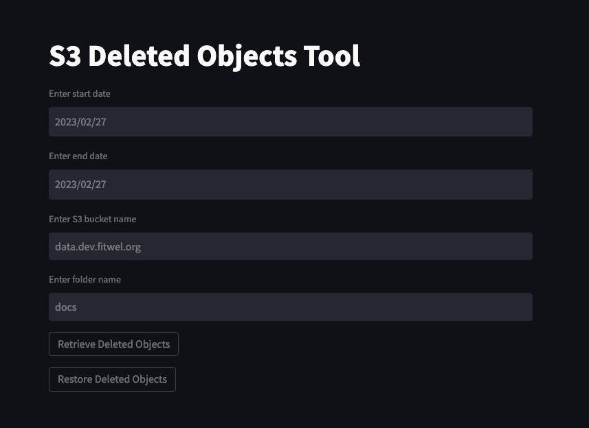

## S3 Recovery tool

Requirements:

Python >=3.8
Your bucket should have 'versioning enabled'

Install the requirements from the requirements.txt file:

````pip install -r requirements.txt ````

Then just run: ```streamlit run main.py```

You should have the AWS credentials configured in your machine

